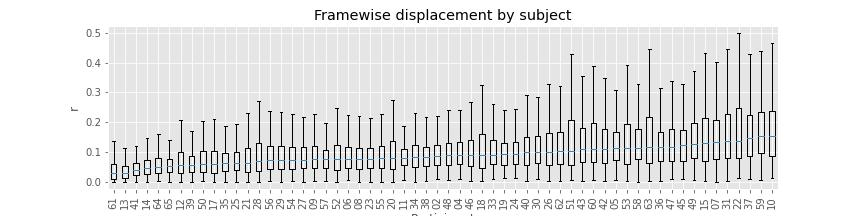

# LST-preprocessed
Code for the preprocessing and QC of the LST7T dataset.

Contact me for more information.

## Preprocessing
Fmriprep was run on the LST BIDS data. Due to the nature of the 7T, in particular the MP2RAGE structural scans we used a no freesurfer based pipeline. In addition no fieldmaps were collected and SBREF files could not be used. Generating EPI-based fieldmaps or incorporating the SBREF files results in major errors in the preprocessed images. With a lot of trial and error we found that a basic "volumetric" approach produces the best images with fewer errors.

The following flags were used:
  --output-spaces MNI152NLin2009cAsym \
  --output-layout bids \
  --n_cpus 12 \
  --mem-mb 30000 \
  --low-mem \
  --resource-monitor \
  --fs-no-reconall \
  --fs-license-file /software/freesurfer/freesurfer-6.0.1/license.txt
  
  ## QC / sanity checks
  Given the difficulties with this data I performed extra quality control analyses. These were undertaken with the assumption that better subjects will show clearer task activations. The clarity of finger-specific motor activations in particular, which are basically orthogonal to the reasoning aspect of the LST, were considered as a bench mark.
  1. Typical head motion, see __.ipynb__
  2. Motor GLM approach, see __.ipynb__
  3. Reasoning GLM approach, see __.ipynb__
  
  ### Head motion
  
  

  ### GLMs
  #### Group level finger representations
  (Bonf corrected @ 0.001 (high threshold!))
  
  
  
  
  

  #### Similarity between participants (low = bad)
  

  #### Group level relational complexity representations
  
  

  #### Similarity between participants (low = bad)
  

